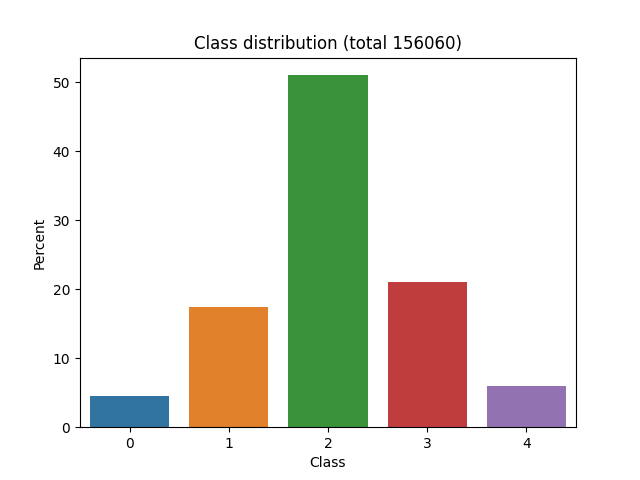
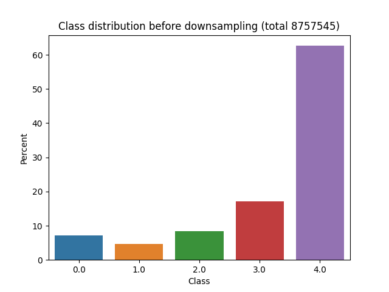

# Sentiment Classification on Movie Reviews (Kaggle)
This is the final project for the Neural Representation Seminar SS21 @LMU 

for this project we will consider 3 transformer models, based or identical with BERT for sentiment classification.
Mainly two aspects will be experimented with, the heavy imbalance in the used dataset and the classification algorithm, 
namely the classification head.
All three models are finetuned to the task and a final cross evalutaion is done on an external dataset.

## Models
The models considered are ``bert-base-uncased``, ``distillbert-base-uncased`` and ``deberta-base-uncased``.
We use them in their pretrained form from Huggingface.  For ``distillbert-base-uncased`` and ``deberta-base-uncased`` only the 
base is used as we use a custom head for the experiments.
All models are fairly large but still trainable on a decent setup.


|               | #parameters    |   |
| ------------- |:-------------:| -----:|
| distillbert-base-uncased       | 66,957.317       |  |
| bert-base-uncased              | 109,486,085      |    |
| deberta-base-uncased           | 139,394,309         |     |

for ``distillbert-base-uncased`` and ``deberta-base-uncased`` parameters are counted after adding the classification head
## Data
###Training
The models are fintuned on the [Movie Review Sentiment Analysis](https://www.kaggle.com/c/movie-review-sentiment-analysis-kernels-only
) Dataset by Kaggle, which is based on the [Deep Learning for Sentiment Analysis](https://nlp.stanford.edu/sentiment/) 
dataset from Stanford which is based on the rottentomatoes.com dataset collected and published by Pang and Lee(2005).
The original sentences where split into phrases and then hand annotated with a sentiment ranging from negative 0 - 4 positive.

#####Sample
```bash
train.tsv is of the form 
PhraseId	SentenceId	Phrase	Sentiment
64      2       This quiet , introspective and entertaining independent is worth seeking .      4
65      2       This quiet , introspective and entertaining independent 3
66      2       This    2
67      2       quiet , introspective and entertaining independent      4
68      2       quiet , introspective and entertaining  3
69      2       quiet   2
70      2       , introspective and entertaining        3
71      2       introspective and entertaining  3
72      2       introspective and       3
73      2       introspective   2
74      2       and     2
75      2       entertaining    4
76      2       independent     2
77      2       is worth seeking .      3
78      2       is worth seeking        4
79      2       is worth        2
80      2       worth   2
81      2       seeking 2
```
of the 156,060 samples, unsurprisingly the distribution of classes is heavily dominated by the "neurtal" class 2



which, unmitigated, would lead to learning that picking 2 every time would already guarantee around 50% accuracy.

###Evaluation
To measure affects of the experiments and external dataset is used. We use the Amazon Review Dataset in the 
categories Movies/TV obtained from [https://cseweb.ucsd.edu/~jmcauley/datasets.html](https://cseweb.ucsd.edu/~jmcauley/datasets.html)

```bash
Id  Sentiment	Phrase
11	1.0	"Thin plot. Predictable ending.  Beautiful setting.  Recent hurricanes certainly didn't look this romantic. Shouldn't make anyone want to ""ride it out."""
12	2.0	Oldie but goodie
```


###Balancing the classes
Traditional methods for mitigating problem arising from unbalanced data include simple strategies like up and downsampling or
more sophisticated ones like SMOTE. 
While upsampling will inevitably lead to overfitting downsampling will reduce overall performance due to throwing away
(possibly most of the) data. SMOTE tries to mitigate the above synthesizing data by computing nearest neighbours of datapoints
in the minority class. While this might work with lowdomensional representations, with highdimensional token representations
this becomes computationally difficult. 


##Experiments

####Middlesampling
Addressing the problems arising from up/downsampling we will try a, admittedly naive, compromise strategy of picking the class with the median magnitude
, upsample the smaller classes and downsample the larger classes.

####Classification
When using a transformer output for classification there is two traditional design choices, either use the 
representation of the [CLS] token denoting the beginning of the sequence or average all token representations as input
for the classification head. Since the original data does not use the [CLS] token the variant of just using the 
first token is also tried. 

##Method
The training set is processed by adding a [CLS] token if needed an then split into stratified train- and testset by a ratio 0.1.
The maximum length of the sequences was limited at 150 due to memory constraints
After sampling was performed training was done for 4 epochs. This should be increased as testaccuracy has not hit the maximum
but one epoch DeBerta training took around 45m on a intel i9 K9900 and a NVIDIA 2070 8GB with 64GB RAM, that posed a limiting factor.

###Datadimensions
|set |        sampling            | size  |
| ------------- |:-------------:|:----------------:|
| train         | down            | 31824         | 
| test          | down            |  3536          | 
| evaluation    | down            | 28556            | 
| train         | middle          | 122728         | 
| test          | middle          |  13637          | 
| train         | up              | 358119         | 
| test          | up              |  35810          | 

## Results
The datasets used for training differ quite a bit. Max lenth of the kaggle data is 80 tokens while the amazon data exceeds 400 tokens.
We consider changes  in the results rather than absolute values in the evaluation results.
Only ``distillbert-base-uncased`` and ``deberta-base-uncased`` have custom classification heads therefore averaging over the outputs is only reported for those


|model |        sampling            | classification  |testset accuracy| cross evaluation accuracy   |
| ------------- |:-------------:|:-------------:|:-------------:|: -----:|
| BERT          | down               | cls            | 0.68        |   0.56                |
| Distillbert   | down               | cls            | 0.67        |   0.54                |
| DeBerta       | down               | cls            | 0.68        |   0.57                |
| BERT          | middle             | cls            |             |                       |
| Distillbert   | middle             | cls            |             |                       |
| DeBerta       | middle             | cls            |             |                       |
| BERT          | middle             | no_cls         | 0.77        |   0.70                |
| BERT          | middle             | avg            |             |                       |
| Distillbert   | middle             | avg            |             |                       |
| DeBerta       | middle             | avg            |             |                       |
