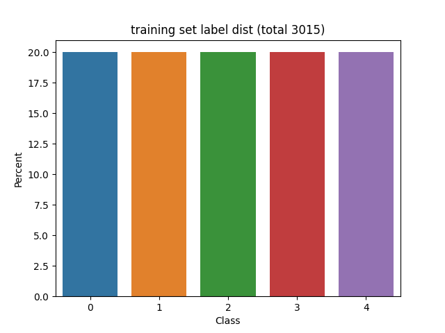

# Sentiment Classification on Movie Reviews (Kaggle)
This is the final project for the Neural Representation Seminar SS21 @LMU 

https://www.kaggle.com/c/movie-review-sentiment-analysis-kernels-only

## Model
out-of-the-box pretrained ``bert-base-uncased`` from the transformers lib from huggingface with multiclassification head

## Data
```bash
train.tsv is of the form 
PhraseId	SentenceId	Phrase	Sentiment
1	1	A series of escapades	    2
2	1	A series	            2
```



 The dataset is clearly very unbalanced, we should have 50% acc guaranteed if the model picks 2 all the time
Up/Downsampling shoulf be tried.
## Usage
```bash
./train.py path/to/training_data --split .1
```
will read data file and splits it into training- and testset by 0.1 
preserving the distribution of the classes

```bash
./eval.py path/to/checkpoint/model path/to/data/testdata
```
will evaluate a saved model

```bash
./submission.py path/to/checkpoint/model path/to/data/testdata
```
will create an output file in the format required by the kaggle competition 

## Results
testset accuracy is generally slightly above 70%, which is slightly better than what most participants report